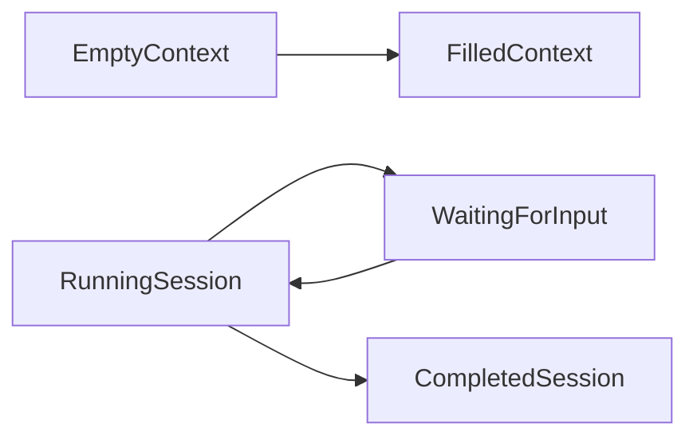

# Agent Session State Variants

## Architecture
- Preserve the standard behavior in [components/blocks/agent-sessions/index.tsx](components/blocks/agent-sessions/index.tsx), extract its repeated open/close shell where useful, and move the experimental implementation into focused modules under `components/blocks/agent-sessions/experimental/`. Expose only a minimal `initialExperimentalPreset: "empty" | "filled" | "running"` API.
- Add typed fixtures under `components/blocks/agent-sessions/data/` plus an internal reducer/controller for two independent dimensions: context data is empty or filled; each chat/session is running, waiting, or completed. Support concurrent sessions, deterministic timed progress, replies that resume waiting sessions, page-session persistence, and exhaustive status handling. Keep this local prototype model separate from the persisted Jira RFP backend lifecycle while following its established status vocabulary where the concepts match.

## Experimental work-item surface
- Reuse the Jira work-item data/provider and interior composition from [components/projects/jira/components/work-item-modal/index.tsx](components/projects/jira/components/work-item-modal/index.tsx) and [app/contexts/context-work-item-modal.tsx](app/contexts/context-work-item-modal.tsx), but give the experimental variant its own accessible dialog shell plus focused Context, Activity, Sessions, and metadata owners. Include dialog labeling, Escape handling, focus containment/restoration, and no hidden tabbables without changing the standard modal's visuals or domain behavior.
- Context:
  - Match the click-to-edit treatment from [components/blocks/agent/components/agent-config-profile.tsx](components/blocks/agent/components/agent-config-profile.tsx) for title and description.
  - Put a generated, read-only TL;DR and next steps above the description; refresh regenerates seeded content and selecting a next step opens the work-item chat with a prefilled command.
  - Follow the Agent block’s empty-to-filled pattern from [components/blocks/agent/components/agent-filled-config-summary.tsx](components/blocks/agent/components/agent-filled-config-summary.tsx): empty attachment/subtask/link buttons open anchored local popovers; selected resources become compact summary rows with add/remove behavior. Derive filled state from meaningful context data.
  - Match the supplied current-experience screenshots for the popover workflows:
    - Attachments uses `Upload files`, `Link content`, and `Create new` tabs. Upload supports the upload CTA/drop-zone treatment; Link content provides search-or-paste, optional display name, recent items, and suggested attachments; Create new lists Page, Live doc, Whiteboard, and Loom video.
    - Subtasks uses `Create new` and `Add existing` tabs. Create new provides an inline subtask name plus suggestions; Add existing provides search and selectable work-item results.
    - Linked work items uses `Create new` and `Add existing` tabs. Both include relationship selection; Create new also selects work-item type and name, while Add existing provides scope/search, recent issues, and similar-work-item suggestions.
  - Keep these flows deterministic and page-local: use seeded choices, keyboard-friendly tabs/menus/results, and no upload, Jira, Confluence, or Loom network calls.
- Activity:
  - Reuse [components/blocks/chat-composer/page.tsx](components/blocks/chat-composer/page.tsx) for a unified comment/command composer, with lightweight local `@agent` and `/skill` suggestions.
  - Render chronological human and agent events. Agent entries use a Cursor-chat-body-like inline block aligned to VPK tokens: identity, running/waiting/completed status, and a clamped 1–2 line command/response preview. Do not expose chain-of-thought inline; clicking opens the full session.
- Right rail:
  - Add the dedicated “3 agents working” style panel above metadata. Show every work-item chat/session, active first and completed below; each row reopens its chat. The count reflects running/waiting agents.
  - Reuse [components/blocks/agent-selector/components/agent-selector.tsx](components/blocks/agent-selector/components/agent-selector.tsx). A selection starts immediately, closes the menu, and disables/marks already-active agents.
  - Keep status, priority, assignee, reporter, and due date locally editable; secondary toolbar actions remain visual unless existing shared behavior already applies.
  - Preserve the desktop Context/Activity plus right-rail layout; stack Context → sessions → Activity → metadata into one scroll flow at narrow widths.

## Unified chat/session experience
- Treat an agent session and chat session as the same work-item-scoped entity. Do not write mock sessions into global Rovo history.
- Use [components/projects/shared/components/floating-rovo-button.tsx](components/projects/shared/components/floating-rovo-button.tsx) as the single launcher. On an empty work item it creates a general work-item Rovo session; after selection it reopens the latest session.
- Build the floating session body from existing VPK chat chrome/message patterns and [components/ui-custom/chain-of-thought.tsx](components/ui-custom/chain-of-thought.tsx). The full chat shows seeded transcript, high-level progress/tool steps, and a local interactive composer; it never presents hidden reasoning. Activity `@` replies and chat replies share the same session state and can resume waiting agents.

## Presets, tests, and validation
- Update [components/blocks/agent-sessions/page.tsx](components/blocks/agent-sessions/page.tsx) with an external Empty/Filled/Running chooser that remounts the standalone experimental block deterministically. Keep the current Standard/Experimental website registry entries; do not add preview slugs.
- Rewrite the source-shape assumptions in [components/blocks/agent-sessions/agent-sessions.test.js](components/blocks/agent-sessions/agent-sessions.test.js) and add focused behavioral coverage for preset initialization, context derivation, concurrent launch, running → waiting → completed timing, resume from chat/Activity, session switching, and a standard-variant regression.
- Validate with `node --test components/blocks/agent-sessions/agent-sessions.test.js`, `pnpm run test:catalog`, `pnpm run verify:repo-map`, `pnpm run lint`, and `pnpm run typecheck`; then browser-check light/dark themes, desktop and stacked layouts, 200% zoom, keyboard/focus behavior, reduced motion, selector/chat interactions, and scoped accessibility. Use the Figma frames as exploratory visual references rather than literal hidden-layer requirements.
